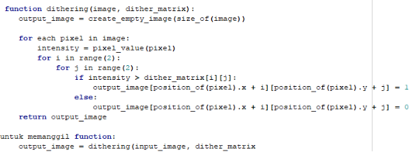
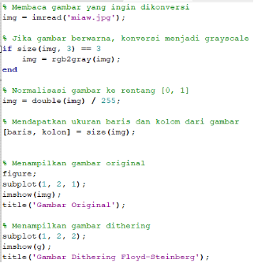

**LAPORAN TUGAS 3** 

**PEMROSESAN CITRA DIGITAL**

` `**HALFTONING, PATTERNING DAN DITHERING**

**(ABKC6404)**

**Dosen Pengampu :**

Dr. Harja Santana Purba M.Kom.

Novan A.B. Saputra, S.Kom., M.T

**Disusun Oleh :**

Indah Jumiatin		(2310131220009)

**UNIVERSITAS LAMBUNG MANGKURAT BANJARMASIN**

**FAKULTAS KEGURUAN DAN ILMU PENDIDIKAN**

**PROGRAM STUDI PENDIDIKAN KOMPUTER**

**2024**

# **DAFTAR ISI**

#
[**DAFTAR ISI**	2](#_toc178151049)

[**PENDAHULUAN**	3](#_toc178151050)

[**HASIL DAN PEMBAHASAN**	4](#_toc178151051)

[**DAFTAR PUSTAKA**	13](#_toc178151052)

#

# **PENDAHULUAN**
Pemrosesan citra digital adalah bidang yang mempelajari cara mengubah dan menganalisis gambar digital. Salah satu teknik penting di bidang ini adalah halftoning, yang memungkinkan kita membuat gambar dengan berbagai tingkat keabuan menggunakan titik-titik hitam dan putih. Teknik ini sangat berguna dalam percetakan untuk menciptakan ilusi gradasi warna pada kertas. Selain halftoning, ada juga patterning dan dithering. Patterning menggunakan pola tertentu untuk mengatur piksel dalam gambar, sedangkan dithering menyebarkan variasi warna ke piksel-piksel di sekitarnya untuk membuat gambar terlihat lebih halus. Dalam laporan ini, saya akan menjelaskan secara sederhana tentang halftoning, patterning, dan dithering. Saya juga akan membahas metode, langkah-langkah, cara perhitungan, dan contoh perhitungannya beserta outputnya, termasuk pseudo code untuk patterning dan dithering.

# **HASIL DAN PEMBAHASAN** 

1. Mempelajari atau menjelaskan kembali secara detail dan sederhana
1. halftoning
1. patterning
1. dethering

1. Halftoning 

   Digital halftoning* adalah suatu proses untuk mengkonversi citra yang kontinu ke dalam suatu *array* berupa titik-titik. Jika dilihat oleh sistem visual manusia, pola tersebut akan menciptakan suatu ilusi sehingga citra tersebut tampak bukan seperti citra hitam putih, namun seperti citra abu-abu yang kontinu.

   Sederhananya, halftoning adalah proses menghasilkan pola biner dari titik hitam dan putih yang dikombinasikan sehingga ada menampakkan gradasi warna abu-abu. padahal warnanya hanya titik hitam dan titik putih saja.

   `	`Halftoning* bertujuan untuk memberikan kesan warna citra biner tampak seperti citra abu-abu meskipun hanya menggunakan piksel warna hitam dan putih saja. Meskipun teknik ambang batas (*thresholding*) yang sederhana ini dapat mengkonversi citra abu-abu menjadi citra biner, namun kualitas citra yang dihasilkan masih kurang baik. Untuk memperbaiki keterbatasan ini, pada tulisan ini akan disimulasikan citra biner yang dikonversi dari citra abu-abu menggunakan metode *ordered dithering (Citra & Metode, n.d.).*

Metode Halftoning :

1. Patterning atau Thresholding 

   Metode paling sederhana di mana setiap piksel dibandingkan dengan nilai ambang batas. Jika lebih besar dari ambang, piksel menjadi putih; jika lebih kecil, menjadi hitam. Namun, metode ini sering menghasilkan gambar yang kasar dan tidak halus.

1. Ordered Dithering

   Metode yang lebih canggih di mana pola titik-titik diatur dalam urutan tertentu untuk menciptakan ilusi gradasi yang lebih halus. Pola ini biasanya disimpan dalam matriks yang disebut matriks dither (Septiana, 2013).

   Contoh :

Bayangkan sebuah gambar di koran. Jika dilihat dari dekat, gambar tersebut terdiri dari banyak titik hitam kecil. Namun, dari jauh, mata kita melihatnya sebagai gambar abu-abu. Ini terjadi karena mata kita menggabungkan detail-detail halus dan merekam intensitas keseluruhan.

*Gambar  ilusi koran*

1. Patterning

   Patterning dalam konteks halftoning digital adalah teknik yang digunakan untuk menciptakan ilusi gradasi warna atau nada kontinu pada perangkat output biner, seperti printer atau layar yang hanya dapat menampilkan dua warna (biasanya hitam dan putih). Teknik ini sangat penting dalam pemrosesan citra digital untuk menghasilkan gambar yang tampak halus dan realistis meskipun perangkat hanya dapat menampilkan titik-titik diskrit.

   Patterning atau pola merupakan teknik paling sederhana dari tiga teknik untuk menghasilkan gambar halftoning digital. Teknik ini menghasilkan gambar dengan resolusi spasial lebih tinggi daripada gambar sumber. Jumlah sel halfton pada gambar keluaran sama dengan jumlah piksel pada gambar sumber. 

1. Dethering

   Teknik lain yang digunakan untuk menghasilkan gambar halftoning digital adalah dithering. Tidak seperti patterning, dithering menghasilkan gambar keluaran dengan jumlah titik yang sama dengan jumlah piksel pada gambar sumber. Dithering dapat dianggap sebagai thresholding gambar sumber dengan matriks dither. Matriks diletakkan berulang kali di atas gambar sumber. Di mana pun nilai piksel gambar lebih besar daripada nilai dalam matriks, titik pada gambar keluaran akan terisi 

   Dithering adalah teknik untuk membuat gambar hitam putih terlihat seperti gambar abu-abu dengan menggunakan pola titik-titik hitam dan putih. Teknik ini menggunakan matriks dither untuk menentukan apakah sebuah piksel akan menjadi hitam atau putih.

   `	`Sebuah matriks pembatas yang disebut dengan matriks *dither.* Masing-masing elemen dari blok asli dikuantisasi sesuai dengan nilai batas pada pola *dither*. Nilai-nilai pada matriks *dither* adalah tetap, tetapi bisa bervariasi sesuai dengan jenis citra. 

	

1. pada proses patterning dan dethering cari metode, langkah-langkah, cara perhitungan, dan contoh perhitungannya beserta outputnya dan bagaimana perbandingannya, cari juga pseudo code nya.

1. **Petterning (pola)**
- Metode patterning
1. Thresholding

   Metode ini digunakan untuk mengubah citra grayscale menjadi citra biner dengan menetapkan ambang batas tertentu.

1. Edge Detection

   Metode ini digunakan untuk mendeteksi tepi atau batas objek dalam citra. Algoritma yang umum digunakan termasuk Sobel, Canny, dan Laplacian.

1. Morphological Operations

   Metode ini digunakan untuk memproses struktur bentuk dalam citra, seperti dilasi, erosi, pembukaan, dan penutupan.

1. Template Matching

   Metode ini digunakan untuk menemukan bagian dari citra yang sesuai dengan template yang diberikan (Basuki, 2004).

- Langkah-langkah patterning

Teknik ini mengubah citra grayscale menjadi citra biner dengan menetapkan nilai ambang (threshold). Piksel yang nilainya di atas ambang akan diubah menjadi putih, sedangkan yang di bawah ambang akan diubah menjadi hitam.

Langkah-langkah: 

1. Tentukan nilai ambang (threshold).
1. Bandingkan setiap piksel dengan nilai ambang.
1. Ubah piksel menjadi hitam atau putih berdasarkan perbandingan tersebut.

- Contoh dan cara perhitungan  patterning 

  Contoh ambang batas atau pixel patterning pola matriks 3x3

Keterangan:

- Gambar Grayscale dengan 8 bit = 256 warna
- Maka angka pixelnya 0-255
- Setiap pola menampung 26 warna masing-masing 
- 1 pixel berubah menjadi 3x3 atau 3 kali lipat untuk perhitungannya

Perhitungan pixel pola matrix 2x2 

Untuk melakukan perhitungannya yaitu menentukan nilai pola pixel dengan cara membandingkan setiap nilai pixel dengan ambang batas.

- 129 berada di ambang batas pola ke-4 yang nilainya (104-129)
- 170 berada di ambang batas pola ke-6 yang nilainya (156-181)
- 200 berada di ambang batas pola ke-7 yang nilainya (182-207)
- 45   berada di ambang batas pola ke-1 yang nilainya (26-51)

Setelah selesai menentukan nilai pola pixel, sesuaikan gambar pola dengan nilainya berada di pola keberapa dan arsir dengan melihat ambang batas atau pixel patterning yang sudah ditentukan batas polanya 

- Pseudo Code untuk Patterning 

	

`	`patterning pada octave :

Hasil :

1. **Dethering** 
- Metode dethering
  1. Floyd-Steinberg Dithering

     Metode ini adalah salah satu algoritma dithering yang paling terkenal. Algoritma ini bekerja dengan menyebarkan kesalahan piksel ke tetangga terdekatnya.

  1. Ordered Dithering

     Metode ini menggunakan matriks pola yang telah ditentukan untuk mengatur piksel dalam gambar. Salah satu variasi yang terkenal adalah Bayer Matrix.

  1. Atkinson Dithering

     Metode ini adalah variasi dari Floyd-Steinberg yang menyebarkan kesalahan ke enam piksel tetangga.

  1. Jarvis, Judice, and Ninke Dithering

     Metode ini menyebarkan kesalahan ke 12 piksel tetangga, menghasilkan hasil yang lebih halus dibandingkan Floyd-Steinberg.

  1. Stucki Dithering: 

     Metode ini adalah variasi dari Jarvis, Judice, and Ninke yang menggunakan bobot kesalahan yang berbeda (Gonzalez, 2008).

- Langkah-langkah dethering

  Setiap piksel gambar dibandingkan dengan nilai dalam matriks dither. Jika nilai piksel lebih besar dari nilai dalam matriks, piksel tersebut akan menjadi putih (1). Jika tidak, piksel akan menjadi hitam (0).

  Jika > treshold = w (white) atau 1

  Jika <= treshold = b (black) atau 0

- Contoh dan cara perhitungan dethering

  Contoh  matrix dither dengan pola 2x2

  ![ref1]

  ![ref2]

  ![ref3]

  ![ref4]

Perhitungan matrix dither 2x2 dengan nilai dither:

Untuk melakukan perhitungannya yaitu setiap piksel gambar dibandingkan dengan nilai dalam matriks dither.

- 0      <    1         = 	kurang dari , maka nilainya 1 (putih)
- 128  <    129     = 	kurang dari , maka nilainya 1 (putih)
- 192  >    180     = 	lebih dari , maka nilainya    0 	(hitam)
- 64    <    65       = 	kurang dari , maka nilainya 1 (putih)

- Pseudocode

dithering pada octave :

Hasil :

# **DAFTAR PUSTAKA**

Basuki, A. (2004). Pengantar Pengolahan Citra. *Pengolahan Citra Digital*, *Bagian 1*, 1–10. http://rosni-gj.staff.gunadarma.ac.id/Downloads/files/15431/pendahuluan.pdf

Citra, H., & Metode, M. (n.d.). *Halftoning citra menggunakan metode ordered dithering*. 237–241.

Gonzalez, R. C. (2008). *www.EBooksWorld.ir*.

Septiana, L. (2013). HALFTONING CITRA MENGGUNAKAN METODE ORDERED DITHERING. *Jurnal Teknik dan Ilmu Komputer*, 238-240.

[ref1]: Aspose.Words.f1ba5f44-2d3b-45ac-9a63-f78412cca389.009.png
[ref2]: Aspose.Words.f1ba5f44-2d3b-45ac-9a63-f78412cca389.010.png
[ref3]: Aspose.Words.f1ba5f44-2d3b-45ac-9a63-f78412cca389.011.png
[ref4]: Aspose.Words.f1ba5f44-2d3b-45ac-9a63-f78412cca389.012.png
